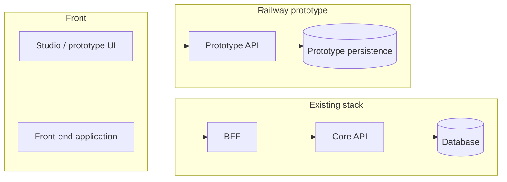

# Prototype approach: dedicated API on Railway

This document explains **why** and **how** we set up a Railway-hosted application
(a separate back end) to run a prototype quickly, alongside the existing
application stack (BFF, Core API, database).

---

## 1. Context

### 1.1 Limited back-end capacity

On this project, how fast the “legacy” back end can evolve is constrained by
available time and team load. For a prototype we need **credible persistence
without immediately committing** to the full BFF → Core API → migrations →
large-code-review cycle.

### 1.2 The “classic” path is heavy for fast iteration

Today the front end talks in production to a **BFF**, which integrates with a
**Core API** to reach the **database**. That path fits robustness and product
consistency, but it implies:

- many files and a large review surface;
- long round-trips for a simple field addition or model change;
- inertia that clashes with **prototype velocity** (assumptions challenged
  weekly, entities renamed, relationships adjusted).

In an exploration phase we want to **reshape data at the pace of the prototype
user journey**, not at the pace of the industrial pipeline.

---

## 2. Chosen approach

We created a **back-end application hosted on Railway** (e.g. NestJS + light
persistence such as PostgreSQL via Prisma), exposed at an **API URL separate**
from the BFF.

The “studio” front end (or the prototype slice of the front end) calls this API
for prototype needs **without going through** the BFF for those flows.

---

## 3. Architecture diagram (simplified)

**How to read it:**

- **Traditional path**: front end → BFF → Core API → database — stable domain
  data, strong governance.
- **Prototype path**: studio UI → Railway API → prototype-only persistence —
  fast iteration, deliberately narrow scope.

---

## 4. Benefits we identified

### 4.1 Velocity and modeling freedom

- Adding or renaming fields, new entities, relationship tweaks: **a handful of
  files** on the prototype side, short cycles.
- Suited to concepts **still decoupled** from the historical domain model
  (e.g. publication, platform, distribution in repurposing / external
  publishing), as long as we avoid premature integration with the core stack.

### 4.2 Interface contract toward hardening in production

The prototype can expose a **clear HTTP contract** (e.g. **OpenAPI /
Swagger**). That gives whoever **will carry the flow into production**:

- a **readable roadmap** (endpoints, schemas, errors);
- a basis to decide **where** logic will live next (BFF, Core API, new service);
- the option, once logic is mature, to **reuse or extract** pieces (services,
  rules) instead of restarting from scratch with no reference.

### 4.3 “Real” persistence without blocking the core stack

A small database on Railway supports **persistent** user scenarios (demos,
tests, multi-day flows) without waiting for monolith back-end migrations and
deployments.

---

## 5. Limits and trade-offs

### 5.1 Environment not equivalent to internal production

The Railway space for the prototype **does not** match the security, compliance,
and observability bar of “official” infrastructure. That is not a flaw: it is a
**deliberate trade** for speed, provided we accept its constraints.

### 5.2 Rules we impose (data and secrets)

To limit risk despite a more exposed host:

1. **No sensitive data** (heavy PII, secrets, long-lived tokens, critical internal
   identifiers, etc.) may be stored in prototype persistence.
2. **No “secured” information** in the privileged-access sense: if a value must
   not leak in plain text outside the production perimeter, it does not go on
   Railway.
3. **Do not store full URLs** to protected or sensitively signed resources.
   Prefer **stable keys** (asset key, S3 key, logical id) and let the **front
   end** (or a signed flow on the core stack) rebuild a **signed / pre-signed URL**
   at access time.

These rules keep the prototype credible while keeping attack surface and data
exposure **bounded** if the environment were compromised.

### 5.3 What does not replace the BFF

As soon as a feature **depends on existing context** (MXT analysis, transcript,
permissions, etc.), the prototype has **no reasonable alternative** but to keep
using the **BFF** (and the chain behind it). The Railway API is not meant to
duplicate the whole domain: it serves **new building blocks** under
exploration.

---

## 6. Summary

| Goal                                      | Role of the Railway API / dedicated persistence |
| ----------------------------------------- | ----------------------------------------------- |
| Iterate quickly on the model              | Yes — prototype scope                           |
| Replace BFF / Core for everything         | No — out of scope and counter-productive        |
| Document product intent                   | Yes — OpenAPI contract as bridge to production  |
| Store secrets or sensitive URLs           | No — forbidden by our rules                     |

This document can evolve with the prototype (new risks identified, decision to
migrate a flow into the core stack, etc.). Additions and fixes are welcome in
collective review.

---

## 7. Next steps (to complete together)

- Link this document to **Swagger** generated or published from the prototype
  repo.
- List **flow by flow**: “prototype only” vs “already on BFF”.
- Define **exit criteria** for the prototype (e.g. Prisma → validated Core
  schema migration, decommissioning Railway persistence for a given domain).
